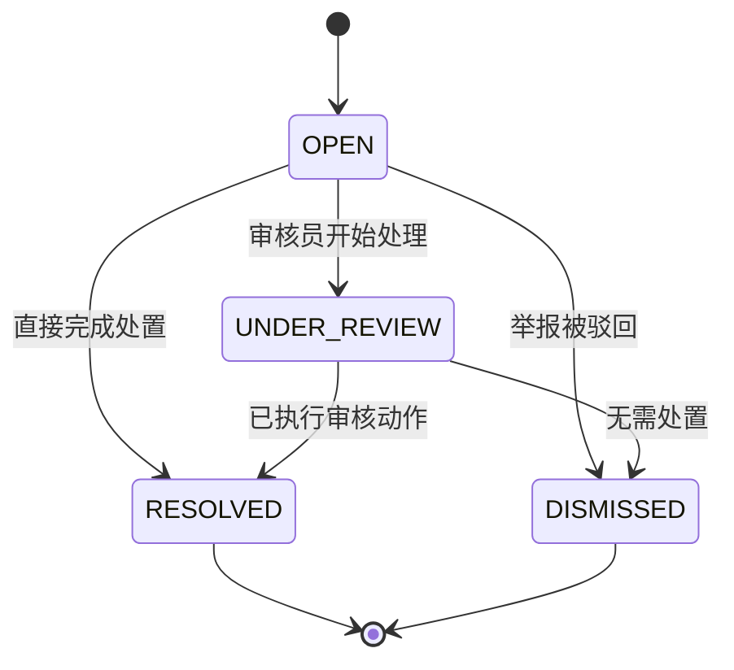
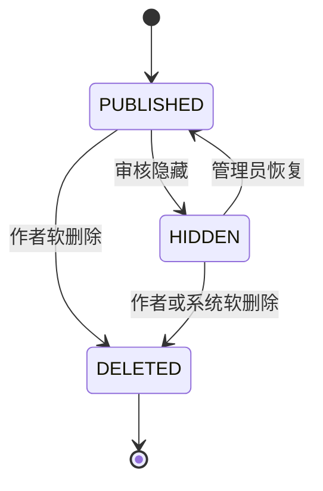

# 审核状态机与权限矩阵

本文档是 Turalk 第一版审核状态机和权限边界的事实来源。实现任何审核动作前，必须确认变更符合本文档；如果不符合，先更新本文档并说明原因。

## 目标

- 保留当前模型：`Report`、`ModerationAction`、`AuditLog` 三表分离。
- 允许审核员处理明确的举报复核工作，但不获得过宽的管理员权限。
- 审核队列和普通管理后台流程不得展示真实身份信息。
- 在加入高风险动作前，先保证证据、业务记录和审计链路完整。
- 不做机械敏感词拦截；治理从举报、人工复核和可审计处置开始。

## 非目标

- 第一轮审核动作不做用户举报，`ReportTargetType.USER` 仅预留。
- 不给审核员或管理员默认开放真实身份查询。
- 不做自动风险评分、关键词拦截或自动处罚。
- 不做批量审核动作。
- 第一轮审核动作不做申诉流程。
- 第一轮审核动作不做公开的管理员授权/撤销接口。

## 当前模型确认

- `AdminRoleAssignment` 已经进入 Prisma schema，并已有 migration：`20260624161823_add_admin_role_assignments`。
- active `MODERATOR` 或 `ADMIN` 可以读取 `GET /api/admin/reports`。
- 举报队列只返回公开用户字段。
- 每次查看举报队列都会写入 `ADMIN_REPORT_QUEUE_VIEWED` 到 `AuditLog`。
- `ReportTargetType.USER` 只存在于 enum 中，没有用户目标关系。没有 `targetUserId` 和用户处置策略前，不开放用户举报。

## 角色边界

`MODERATOR` 是默认审核角色。`ADMIN` 用于更高风险或系统级动作。两个角色都必须来自 active `AdminRoleAssignment`；两个角色默认都不获得实名认证记录访问权。

| 能力                  | MODERATOR | ADMIN  | 第一轮审核动作       |
| --------------------- | --------- | ------ | -------------------- |
| 查看举报队列          | 是        | 是     | 已实现               |
| 标记举报处理中        | 是        | 是     | 计划实现             |
| 驳回举报              | 是        | 是     | 计划实现             |
| 隐藏帖子/评论         | 是        | 是     | 计划实现             |
| 恢复被隐藏的帖子/评论 | 否        | 是     | 仅 `ADMIN`           |
| 警告用户              | 否        | 是     | 后续                 |
| 暂停用户              | 否        | 是     | 后续                 |
| 封禁用户              | 否        | 是     | 后续                 |
| 授予/撤销管理员角色   | 否        | 是     | 后续，单独设计       |
| 查询实名认证数据      | 否        | 默认否 | 后续，单独权限和审计 |

## 举报状态机

`Report.status` 描述复核工作流，不直接描述内容公开可见性。

### ReportStatus 语义

| 状态           | 含义                             | 对公开可见性的影响 |
| -------------- | -------------------------------- | ------------------ |
| `OPEN`         | 新的未处理举报，等待复核。       | 无                 |
| `TRIAGED`      | 预留给后续队列分流或专项升级。   | 无                 |
| `UNDER_REVIEW` | 审核员已经开始处理该举报。       | 第一轮无影响       |
| `RESOLVED`     | 举报已有业务结果，例如隐藏内容。 | 取决于审核动作     |
| `DISMISSED`    | 举报已复核，确认不需要处置。     | 无                 |

第一轮审核动作中，`UNDER_REVIEW` 不应修改 `Thread.status` 或 `Comment.status`。它只修改 `Report.status`。

## 内容状态机

`ContentStatus` 描述帖子和评论的公共可见性。

### ContentStatus 语义

| 状态           | 含义                               | 第一轮审核动作                                            |
| -------------- | ---------------------------------- | --------------------------------------------------------- |
| `DRAFT`        | 预留给后续草稿发布流程。           | 不使用                                                    |
| `PUBLISHED`    | 在普通公共论坛页面可见。           | 既有行为                                                  |
| `UNDER_REVIEW` | 预留给后续内容级审核流程。         | 不由举报复核写入                                          |
| `HIDDEN`       | 被审核动作从普通公共可见性中移除。 | 计划实现                                                  |
| `DELETED`      | 软删除，并从普通公共可见性中移除。 | 评论作者删除已使用；后续内容动作必须保留 `deletedAt` 语义 |

审核隐藏和作者软删除是不同事件。隐藏内容不应设置 `deletedAt`；软删除才设置。

## 第一轮审核动作

下一次代码迭代应实现一个窄接口：

`POST /api/admin/reports/:reportId/actions`

允许的动作输入：

- `MARK_UNDER_REVIEW`
- `DISMISS_REPORT`
- `HIDE_CONTENT`
- `RESTORE_CONTENT`

角色规则：

- `MARK_UNDER_REVIEW`：`MODERATOR`、`ADMIN`
- `DISMISS_REPORT`：`MODERATOR`、`ADMIN`
- `HIDE_CONTENT`：`MODERATOR`、`ADMIN`
- `RESTORE_CONTENT`：仅 `ADMIN`

状态规则：

- `MARK_UNDER_REVIEW`：`OPEN` 或 `TRIAGED` 举报 -> `UNDER_REVIEW`；不修改内容状态。
- `DISMISS_REPORT`：`OPEN`、`TRIAGED` 或 `UNDER_REVIEW` 举报 -> `DISMISSED`；不修改内容状态。
- `HIDE_CONTENT`：`OPEN`、`TRIAGED` 或 `UNDER_REVIEW` 举报 -> `RESOLVED`；目标帖子/评论 -> `HIDDEN`。
- `RESTORE_CONTENT`：已解决举报或未来的直接内容目标；目标帖子/评论 `HIDDEN` -> `PUBLISHED`。第一轮 report action 接口中，优先只允许恢复该举报仍指向的同一内容对象。

实现时应使用稳定的 `409` 错误码拒绝无效或无意义状态转换，例如 `REPORT_ALREADY_RESOLVED`、`CONTENT_ALREADY_HIDDEN`、`CONTENT_NOT_HIDDEN`。

## ModerationAction 与 AuditLog

`ModerationAction` 是治理业务决定的记录。

它应保存：

- 动作类型
- 操作者
- 目标类型和目标 ID
- 原因码
- 审核备注
- 结构化 metadata，例如变更前后的状态

`AuditLog` 是安全与合规审计流水。

它应保存：

- 操作者
- 动作名称
- 资源类型和资源 ID
- request ID（可用时）
- IP hash（可用时）
- 脱敏 metadata

每个成功的审核处置动作都应该同时写入两者。失败或被拒绝的尝试，可以在后续有请求级审计中间件后写 `AuditLog`，但不应该创建 `ModerationAction`。

## 隐私规则

- 管理后台审核响应不得返回 `User.id`、邮箱、密码 hash、refresh token hash、`identityHash` 或 `providerSubjectToken`。
- 举报队列不得展示实名认证字段。
- 举报补充说明不得要求或诱导用户填写真实姓名、手机号、邮箱或身份证号。
- 举报详情、审核备注和内容预览都应视作用户生成或操作员生成文本；前端安全渲染，日志中不要记录未限制的原始请求体。
- `ADMIN` 不等于实名查询权限。未来任何实名查询都需要单独权限、单独接口和单独审计动作。

## 管理后台 UI 要求

实现管理后台 UI 时，优先清晰，不追求复杂视觉：

- 举报队列表格优先。
- 预留状态筛选和原因筛选。
- 目标预览只展示公开作者身份。
- 根据角色明确禁用不可执行动作。
- `HIDE_CONTENT` 和 `RESTORE_CONTENT` 需要确认弹窗。
- 提供审核历史或审计入口。
- 提供 empty、loading、error 状态。

## 实现检查清单

- 修改审核 API 前先阅读本文档。
- `ReportTargetType.USER` 保持禁用，直到数据模型有 `targetUserId`。
- `RESTORE_CONTENT` 保持仅 `ADMIN`。
- 第一轮不把内容状态设置为 `UNDER_REVIEW`。
- 成功业务处置写 `ModerationAction`。
- 敏感访问和变更写 `AuditLog`。
- 补充角色权限、状态转换和隐私输出测试。
- PostgreSQL 可用时，补真实数据库烟测。
